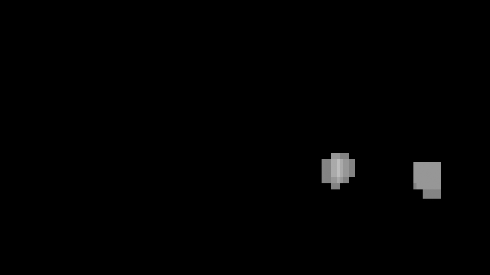

**Vehicle Detection Project**

The goals / steps of this project are the following:

* Perform a Histogram of Oriented Gradients (HOG) feature extraction on a labeled training set of images and train a classifier Linear SVM classifier
* Optionally, you can also apply a color transform and append binned color features, as well as histograms of color, to your HOG feature vector. 
* Note: for those first two steps don't forget to normalize your features and randomize a selection for training and testing.
* Implement a sliding-window technique and use your trained classifier to search for vehicles in images.
* Run your pipeline on a video stream (start with the test_video.mp4 and later implement on full project_video.mp4) and create a heat map of recurring detections frame by frame to reject outliers and follow detected vehicles.
* Estimate a bounding box for vehicles detected.

[//]: # (Image References)
[image3]: ./examples/sliding_windows.jpg
[image4]: ./examples/sliding_window.jpg
[image5]: ./examples/bboxes_and_heat.png
[image6]: ./examples/labels_map.png
[image7]: ./examples/output_bboxes.png
[video1]: ./project_video.mp4

## [Rubric](https://review.udacity.com/#!/rubrics/513/view) Points
### Here I will consider the rubric points individually and describe how I addressed each point in my implementation.  

---
### Writeup / README

#### 1. Provide a Writeup / README that includes all the rubric points and how you addressed each one.  You can submit your writeup as markdown or pdf.  [Here](https://github.com/udacity/CarND-Vehicle-Detection/blob/master/writeup_template.md) is a template writeup for this project you can use as a guide and a starting point.  

This is it.

### Histogram of Oriented Gradients (HOG)

#### 1. Explain how (and identify where in your code) you extracted HOG features from the training images.

I used a jupyter notebook to carry out this project. File is P5.ipynb and exported as P5.html

Using the code in cell 1 I was able to do a visual exploration of the car vs not_cars dataset. There were a total of 8792 car images vs 8968 not_car images. Here's a random pick of a car/not_car:


I then proceeded to explore the car image by using the HOG transform, an implementation of which is in 'skimage.hog()'. I picked 8 images at random and displayed their hog image next to them to get a feel of what they look like. I chose the Luma/chroma YCrCb space and `orientations=9`, `pixels_per_cell=(8, 8)` and `cells_per_block=(2, 2)`:

Here is an example of the output:


The code that performs this visualization is in cell 2

#### 2. Explain how you settled on your final choice of HOG parameters.

In cell 2:22-24 one can set the parameters for the hog image features. I experimeted with a few values. Lower values of orientation counts provide more 'generalization' but less detail.
Here is an example with 16 orientations, and `pixels_per_cell=(16,16)`


At this level of `pixels_per_cell` it seems gradient detection is a bit too sparse. I ended using the values in the example earlier of `orientations=9`, `pixels_per_cell=(8, 8)` and `cells_per_block=(2, 2)`

#### 3. Describe how (and identify where in your code) you trained a classifier using your selected HOG features (and color features if you used them).

I also used spatial binning and the color histogram to augment the hog features before training the classifer. This can be seen in cell 3. The function `extract_block_features` performs all the feature extractions by calling `bin_spatial` cell 3:61, `color_hist` cell 3:66 and `get_hog_features` on cell 3:78. 

The feature extraction for the dataset if finally performed in `extract_features` on cell 3:103-112. The features are then normalized to make sure they are presented with the same magnitude to the classifer. This is done using `StandardScaler()` in cell 3:120-122. I then display the pre normalized vs normalized features with a histogram to make sure data makes sense. This is an example:


The final set of parameters used is defined in the `feat_pars` dic in cell 3:87-99 as follows:
```python
feat_pars = {
    'color_space' : 'YCrCb', # Can be RGB, HSV, LUV, HLS, YUV, YCrCb
    'orient' : 9,  # HOG orientations
    'pix_per_cell' : 8, # HOG pixels per cell
    'cell_per_block' : 2, # HOG cells per block
    'hog_channel' : 'ALL', # Can be 0, 1, 2, or "ALL"
    'spatial_size' : (32, 32), # Spatial binning dimensions
    'hist_bins' : 32,    # Number of histogram bins
    'spatial_feat' : True, # Spatial features on or off
    'hist_feat' : True, # Histogram features on or off
    'hist_range' : (0,256), #hist range
    'hog_feat' : True # HOG features on or off
}
```
Hog features are being used in all channels, as well as spatial features and histogram.

As a classifier I used linear SVM using sklearn.svm. The code to train the classifier is seen in cell 4:8-31. I used a 80/20 split for my training/testing sets cell 4:13. 

### Sliding Window Search

#### 1. Describe how (and identify where in your code) you implemented a sliding window search.  How did you decide what scales to search and how much to overlap windows?

I implemented an algorithm in cell 5:13-78 where a subsampling of the image to be searched is done. This effectively makes the feature windows larger when doing the search. Every time `find_cars` is called a `scale` factor is supplied that defines the resizing stretch. 


#### 2. Show some examples of test images to demonstrate how your pipeline is working.  What did you do to optimize the performance of your classifier?

In order to explore the type of scale to use during the sliding window search, I explored different parameters to see how it would affect detection of cars at different distances, that is at different pixel sizes. Here is the output at different scales (number on top of pictures is the scale factor):


From this I selected 3-4 scales factors to search for. In every case the YCrCb color space was used, HOG features performed in every channel, plus spatially binned color and histograms. Detection was pretty solid.

The selected scale factors as well as their search windows are identified in cell 7:10-46. An example of these is embedded here:
```python        
        self.subsearch_pars_list = [
            {
            'ystart' : 400,
            'ystop' : 500,
            'scale' : 1.0,
            'svc' : svc,
            'X_scaler' : X_scaler,
            'color' : (0,0,255)
            },
            {
            'ystart' : 400,
            'ystop' : 550,
            'scale' : 1.5,
            'svc' : svc,
            'X_scaler' : X_scaler,
            'color' : (255,0,255)
            },
            {
            'ystart' : 400,
            'ystop' : 575,
            'scale' : 2,
            'svc' : svc,
            'X_scaler' : X_scaler,
            'color' : (255,0,0)
            },
            {
            'ystart' : 400,
            'ystop' : 600,
            'scale' : 2.5,
            'svc' : svc,
            'X_scaler' : X_scaler,
            'color' : (255,255,0)
            },
            {
            'ystart' : 450,
            'ystop' : 656,
            'scale' : 3,
            'svc' : svc,
            'X_scaler' : X_scaler,
            'color' : (0,255,255)
            }
        ]
```

Every item in this list results in a call to `find_cars` in cell 7:58, and the detected bboxes are accumulated in `detections` in cell 7:59.  This detections includes ALL the detections at all levels defined in the `subsearch_pars_list`

In order to visualize the actual searching grid that is produced by the above parameters I have defined the `Pipeline.draw_subsampled_searches()` in cell 7:59. This goes through the different search parameters and draws every single location that will be searched. Here is the result for the parameters above:


Every searched level is drawn in different colors. Cars further in the distance correspond to the finer search grid, while cars further close have the bigger search window.


---

### Video Implementation

#### 1. Provide a link to your final video output.  Your pipeline should perform reasonably well on the entire project video (somewhat wobbly or unstable bounding boxes are ok as long as you are identifying the vehicles most of the time with minimal false positives.)
Here's a [link to my video result](./final_output.mp4)


#### 2. Describe how (and identify where in your code) you implemented some kind of filter for false positives and some method for combining overlapping bounding boxes.

In order to remove false positives I did the following:

1. Define a window of frames to clump the detections. The actual value is defined in cell 6:10 with the `self.fbc` mark
2. All the detections are then passed onto `HeatMap.process_frame_detections()` and a heatmap is created of the common areas. 
3. A threshold is applied to the heatmap to remove false positives. I used heatmap_th = 10.
4. The scipy.ndimage.measurements.label function is used to crate labeled boxes. 


The Pipeline for video creation is defined in cell 7 in the class Pipeline(). There are three modes of operation, BBOXES, HEATMAP and LABELED that output different stages of the pipeline for debugging. In particular looking at HEATMAP is useful to identify the correct behavior of the pipeline.

Here's a [link to a heatmap video](./heatmap_output.mp4)

Here are two screenshots from the video. One at frame 0, another one from frame 10. Notice how we are using a grayscale instead of yellow-red representation. 




To produce the final video the LABELED mode is use. This mode draws a box through the thresholded heatmaps to create the final envelope detection.


---

### Discussion

#### 1. Briefly discuss any problems / issues you faced in your implementation of this project.  Where will your pipeline likely fail?  What could you do to make it more robust?

* Further tuning of the hierarchical is needed. The current settings on `subserch_par_list` have been selected through experimentation, but in reality, a wider set of testing images/videos should be employed to tune these search windows.
* The pipeline *correctly* identifies cars coming in the other direction, but in reality they should not be part of the detection as they are not in our line. we could make the search window trapezoidal in nature to ignore cars from the other lanes. Maybe calculate the direction of movement of the cars and if against our flow, flag them as not valid.
* Further tuning of `subsearch_par_list` would yield speed improvements. Right now, there are areas that are searched multiple times at different levels which is likely not needed.
